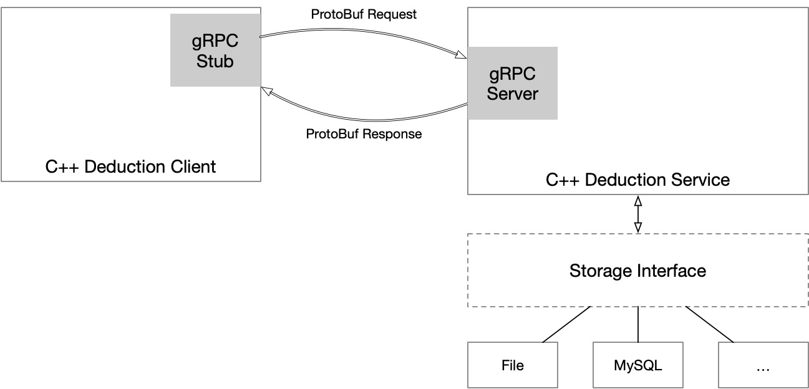

# WechatPay DeductionService
Deduction Service Client and Server in WechatPay.

## Usage
[](https://asciinema.org/a/335539)

First start Deduction Server:

```
./deduction_server
```

Then run below Deduction Client commands:

- Get all the deduction services
```
./deduction_client list 
```

- Open a deduction service
```
./deduction_client open <service_id>
```

- Close a deduction service
```
./deduction_client close <service_id>
```

## Architecture


## Project Structure
```
WechatPayDeductionService
├── api
│   ├── BUILD
│   └── deduction.proto
├── doc
├── src
│   ├── BUILD
│   ├── deduction_client.cc
│   ├── deduction_server.cc
│   ├── helper.cc
│   └── helper.h
├── test
├── README.md
├── WORKSPACE
└── deduction.db
```

- `api` directory for Protocol Buffer files which define the API (service)
- `src` directory for business codes
- `doc` directory for documentations
- `test` directory for test codes.
- `deduction.db` file is a file database for deduction service
- `WORKSPACE` and `BUILD` files is used by Bazel

## Development
### Environment
Below is my own environment:

- macOS Catlina 10.15.5
- C++ Standard: `-std=c++17`
- LLVM CLang: Apple clang version 11.0.3 (clang-1103.0.32.62)
- Protocol Buffer v3: `libprotoc 3.12.2`
- gRPC v1.29.1
- Bazel 3.2.0

Install below dependencies:

- Install Protocol Buffer: `brew install protobuf`
- Install gRPC: `brew install grpc`
- Install Bazel: `brew tap bazelbuild/tap && brew install bazelbuild/tap/bazel`

### Build
Clone this repository and run:
```
bazel build //src:all
```

## Changelog
### v0.1.0
Use single file database `deduction.db` for storage.

Services in `api/deduction.proto`:

- `getDeductionServices` read database and return all deduction services.
- `openDeduction` open the specific service by the service id and update database.
- `closeDeduction` close the specific service by the service id and update database.

## TODO
- Use MySQL database
- Make more secure
- User Login
- Support for change payment of deduction service
- Support for viewing the deduction records of a deduction service
- Integrate googletest
- Integrate Travis CI


## LICENCE
Use [MIT LICENCE](LICENCE)